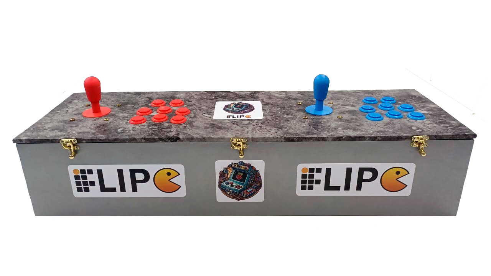
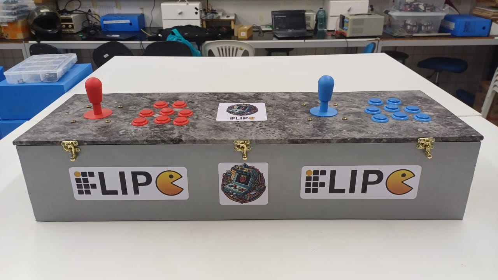

# 🕹️ IFlipe: Montagem de uma Máquina Arcade

  

---

## 🚀 Sobre o Projeto
**Identificador do Projeto:** 7171/2024

Este repositório contém as principais informações e documentações sobre o projeto **"IFlipe: Montagem de uma máquina Arcade"**. O projeto foi desenvolvido como meu Trabalho de Conclusão de Curso (TCC) no curso Técnico de Informática no **Instituto Federal do Rio Grande do Norte (IFRN) - Campus Nova Cruz**.

O objetivo principal do IFlipe é instigar a curiosidade de novos jogadores aos jogos retrô e à área da eletrônica e montagem de hardware. Mais do que entretenimento, a máquina atua como uma **plataforma educativa**, promovendo o interesse nas áreas de programação e eletrônica e incentivando a nova geração a explorar as tecnologias de jogos digitais.

---

## 📚 E-book Completo (Manual de Montagem)

> **⚠️ IMPORTANTE:** A documentação completa do projeto está disponível de forma gratuita!

[https://eltongustavo.github.io/manual-de-montagem-iflipe/ebook.pdf](https://eltongustavo.github.io/manual-de-montagem-iflipe/ebook.pdf)

---

## ⚙️ Hardware e Software (Por Dentro do IFlipe)

Para tornar este projeto realidade, unimos marcenaria, eletrônica e sistemas embarcados. 

O "cérebro" da máquina é um **Raspberry Pi 3 Modelo B**, responsável por todo o processamento, enquanto o sistema **RetroPie** cuida da emulação dos clássicos de Arcade. 

Aqui está uma visão detalhada da parte interna da máquina, mostrando a organização do hardware e o cabeamento dos botões (GPIO):

  

---

## 📸 Galeria e Impacto na Comunidade

O projeto não ficou apenas na teoria. A máquina foi construída, testada e levada ao público!

### O IFlipe Finalizado
Abaixo, o registro do gabinete montado e pronto para o uso:

  

### Aplicação Prática na Semadec
A melhor forma de validar uma plataforma educativa é colocando-a nas mãos dos usuários. O IFlipe foi um sucesso durante a Semadec (Semana de Arte, Desporto e Cultura), cumprindo seu papel de unir nostalgia, lazer e tecnologia.

  

